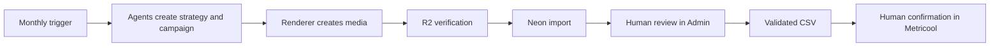
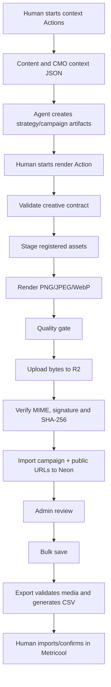
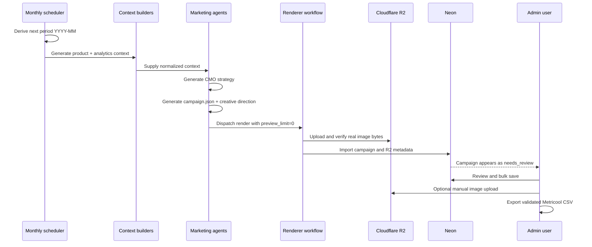
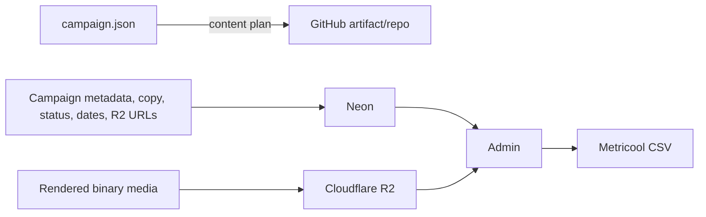

# Innerbloom automated marketing system

**Status:** living architecture document  
**Last verified:** 2026-07-24  
**Scope:** strategy/context generation, campaign production, rendering, R2, Neon, Admin review and Metricool export.

This document is the source of truth for how the marketing system works. Any PR that changes a marketing workflow, agent, campaign schema, renderer, R2 storage, Neon import, Admin review or CSV export must update this document in the same PR.

## 1. Operating principle

The desired system is not “fully automatic publication”. It is:



Everything before the Admin review should be automatable. The human approval boundary remains before export/publication.

## 2. Responsibility types

| Type | Meaning |
|---|---|
| **Agent** | An AI agent makes a content or creative decision and produces a structured artifact. |
| **Automation** | Deterministic code or GitHub Actions moves, validates, renders or persists data. |
| **Human** | A person reviews content, resolves exceptions or authorizes publication. |

A GitHub Action being started with `workflow_dispatch` is **currently manual**, but it is not inherently a human decision. It can usually be chained or scheduled.

## 3. Current production flow



### Current classification

| Stage | Current owner | Current trigger | Must remain manual? |
|---|---|---|---|
| Generate product/content context | Automation | Manual GitHub Action | **No** |
| Generate CMO context | Automation | Manual GitHub Action | **No** |
| Strategy and campaign decisions | Agent | Agent invocation/workflow | **No**, except optional exception review |
| Choose `period_key` | Human input today | Manual Action input | **No**; derive next month automatically |
| Render campaign | Automation | Manual GitHub Action | **No** |
| Validate creative contract | Automation | Render workflow | No |
| Stage Drive/registered assets | Automation | Render workflow | No |
| Render media | Automation | Render workflow | No |
| Upload and verify R2 | Automation | Render workflow | No |
| Import to Neon | Automation | Render workflow | No |
| Review/edit/approve in Admin | Human | Admin UI | **Yes** |
| Add exceptional manual image | Human + automation | Admin UI | **Yes**, only when needed |
| Save unfinished review | Human | `Save campaign` | **Yes**, optional checkpoint |
| Validate and export CSV | Human authorization + automation | `Export CSV` | **Yes**, publication boundary |
| Import and confirm in Metricool | Human | Metricool UI | **Yes** until a supported publishing API replaces it |

## 4. What should be automated next

### Target monthly orchestrator

One scheduled or manually recoverable orchestrator should own the period and chain the existing stages.



### Recommended trigger

- Run once per month, before the next publishing month.
- Derive `period_key` automatically from the scheduled date.
- Keep `workflow_dispatch` as a recovery/manual override.
- Fail closed: if any agent artifact, validation, image or import fails, do not create a partial Admin campaign.
- Send a completion notification only when the campaign is ready in Admin.

### Human approval policy

Do **not** require approval between strategy, campaign generation and rendering by default. Those are reversible pre-publication steps. Preserve only the final review boundary in Admin.

An optional strategy checkpoint may be enabled later for high-risk campaigns, major launches or regulated claims, but it should not block routine monthly production.

## 5. Data ownership



### R2 owns

- PNG, JPEG and WebP files;
- immutable versioned object keys;
- public media delivery.

### Neon owns

- campaign and post records;
- copies, dates, formats and statuses;
- ordered R2 asset references and metadata;
- review state.

### Neon must not own

- base64 image payloads;
- `blob:` URLs;
- temporary browser previews;
- renderer-local file paths.

## 6. Admin behavior

Edits, approvals, date changes and slide removals remain local until one of these actions:

- **Save campaign:** bulk-persist all pending changes and allow review to continue later.
- **Export CSV:** bulk-persist pending changes, validate approved media and download CSV.

Adding a manual image is the exception: the binary uploads immediately to R2 so it is not lost; its post reference is persisted with the next bulk save/export.

## 7. Asset compatibility rules

Every screenshot or visual source should declare a surface and allowed presentation containers.

| Source surface | Allowed | Forbidden |
|---|---|---|
| `mobile` | phone frame, mobile crop, mobile module detail | desktop/browser frame unless explicitly designed |
| `web` | browser frame, laptop/desktop composition, borderless web crop | **phone carcass** |
| `brand` | editorial layouts, backgrounds, scenes | fake product UI |

Hard rule:

```text
web screenshot + phone carcass = validation error
```

Web-browser screenshots should be usable outside phone frames to explain dashboards, analytics, trends and other wide Innerbloom features.

## 8. Failure and recovery

| Failure | Expected behavior |
|---|---|
| Agent artifact invalid | Stop before render |
| Creative contract invalid | Stop before staging/render |
| Render quality failure | Stop before R2 import |
| R2 upload or public verification failure | Stop before Neon import |
| Missing/duplicate asset mapping | Roll back Neon import |
| Admin bulk save failure | Roll back the whole batch |
| Invalid public media during export | Block CSV and identify post/asset |

The R2 repair workflow is an emergency recovery tool, not part of the normal monthly path.

## 9. Backlog

### P0 — Orchestration

- Add one monthly orchestrator workflow.
- Automatically derive the next `period_key`.
- Chain content context → CMO context → agent campaign generation → render/import.
- Preserve manual dispatch as a recovery option.
- Notify when the campaign is ready in Admin or when a stage fails.

### P0 — Asset semantics

- Add `surface`, `source_app`, `viewport`, `allowed_layouts` and `forbidden_layouts` to asset metadata.
- Reject web screenshots inside phone carcasses.
- Add browser, desktop, laptop and borderless web layout families.
- Make Creative Director selection depend on the claim being communicated.

### P1 — Documentation and observability

- Add campaign run metadata: workflow run ID, campaign JSON SHA, renderer version and R2 manifest SHA.
- Improve Action summary with campaign code, post count, image count, verified count and Neon import result.
- Document each agent input/output schema and handoff.
- Add an architecture-document check to marketing PRs.

### P1 — Admin

- Add drag-and-drop carousel ordering.
- Show compact origin/status per asset: generated, manual, verified or broken.
- Show precise export validation errors by post and slide.
- Add campaign archive/hide behavior for tests.

### P2 — Storage lifecycle

- Garbage-collect unreferenced R2 assets after a retention period.
- Keep immutable keys and idempotent re-runs.
- Add campaign/version history and restore points.

### P2 — Metricool integration

- Evaluate whether Metricool offers a suitable API for direct draft creation.
- Keep final human confirmation even if CSV upload becomes automated.

## 10. Definition of done for marketing changes

A marketing-system PR is complete only when applicable items are updated:

- workflow behavior;
- agent input/output contract;
- campaign or asset schema;
- storage ownership;
- Admin behavior;
- manual/automatic responsibility table;
- failure/recovery behavior;
- backlog status;
- this document’s `Last verified` date.
