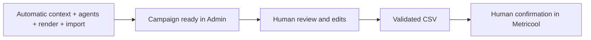
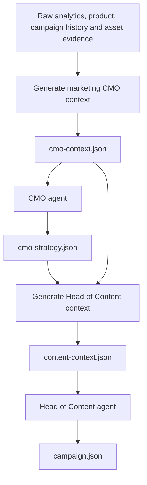
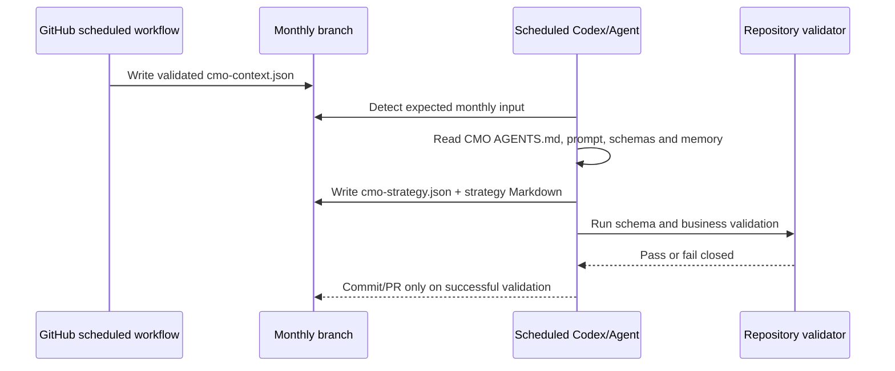
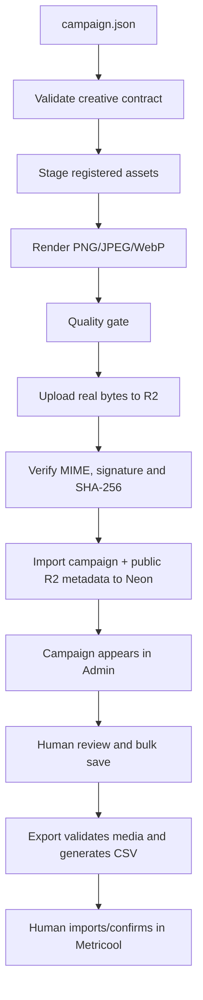

# Innerbloom automated marketing system

**Status:** living architecture document  
**Last verified:** 2026-07-24  
**Scope:** context generation, agent handoffs, campaign production, rendering, R2, Neon, Admin review and Metricool export.

This document is the source of truth for how the marketing system works. Any PR that changes a marketing workflow, agent, campaign schema, renderer, R2 storage, Neon import, Admin review or CSV export must update this document in the same PR.

## 1. Operating principle

The system separates three kinds of work:

| Type | Responsibility |
|---|---|
| **Automation** | Collects data, builds deterministic context, validates schemas, renders, uploads and persists. |
| **Agent** | Reads structured evidence and makes strategic or editorial decisions. |
| **Human** | Reviews campaign output, resolves exceptions and authorizes export/publication. |

A GitHub Action started through `workflow_dispatch` is currently manual, but it is not inherently a human decision. It can be scheduled or chained.

The desired boundary is:



## 2. Canonical agent pipeline

This order is authoritative. Workflow names must not be interpreted as agent names.



### 2.1 Generate marketing CMO context — deterministic automation

Workflow:

```text
.github/workflows/marketing-cmo-context.yml
```

Purpose:

- derive the active period;
- read Neon and approved repository evidence;
- gather acquisition, registration, activation, usage, campaign history, human decisions, asset availability, constraints and tracking quality;
- normalize that evidence;
- validate it against the CMO input schema;
- commit it to the monthly branch.

Output:

```text
marketing/agent-inputs/<YYYY-MM>/cmo-context.json
```

This stage does **not** decide strategy. It prepares evidence for the first reasoning agent.

### 2.2 CMO agent — first external reasoning boundary

Contract:

```text
prompts/marketing/agent-system/cmo/AGENTS.md
```

Input:

```text
marketing/agent-inputs/<YYYY-MM>/cmo-context.json
```

The agent also reads its role prompt, schemas, strategy memory and repository sources referenced by the context manifest.

Responsibilities:

- analyse the evidence by funnel stage and source;
- distinguish facts, assumptions, correlations and data gaps;
- choose the monthly strategic objective, audience, priorities, content pillars, experiments, distribution and measurement plan;
- preserve previous human decisions and restrictions;
- avoid final captions or a post-by-post calendar.

Outputs:

```text
marketing/agent-outputs/<YYYY-MM>/cmo-strategy.json
Docs/marketing/strategies/<YYYY-MM>.md
```

The JSON is the operational source of truth. The agent stops after writing and validating the strategy; it does not invoke the next agent.

### 2.3 Generate Head of Content context — deterministic handoff builder

Workflow:

```text
.github/workflows/marketing-content-context.yml
```

Required inputs:

```text
marketing/agent-inputs/<YYYY-MM>/cmo-context.json
marketing/agent-outputs/<YYYY-MM>/cmo-strategy.json
```

Purpose:

- validate the CMO strategy;
- combine the original evidence with the strategy;
- derive campaign code, publishing window, tracking defaults, supported formats and asset context;
- record the strategy approval wrapper;
- validate and commit the complete input for the Head of Content agent.

Output:

```text
marketing/agent-inputs/<YYYY-MM>/content-context.json
```

This stage does **not** create campaign posts.

### 2.4 Head of Content agent — campaign reasoning

Contract:

```text
prompts/marketing/agent-system/head-of-content/AGENTS.md
```

Inputs:

```text
marketing/agent-inputs/<YYYY-MM>/content-context.json
marketing/agent-outputs/<YYYY-MM>/cmo-strategy.json
```

Responsibilities:

- preserve the approved strategy;
- build campaign architecture;
- generate the exact requested number of posts;
- write hooks, captions, dates, hypotheses, metrics, CTAs, tracking and visual briefs;
- map every post to approved pillars and experiments;
- plan asset work without claiming binary assets already exist;
- set campaign status to `review` and post status to `needs_review`.

Output:

```text
marketing/agent-outputs/<YYYY-MM>/campaign.json
```

## 3. Current automatic and manual boundaries

| Stage | Owner | Current trigger | Inherently human? |
|---|---|---|---|
| Generate CMO context | Automation | Monthly cron or manual Action | No |
| Run CMO agent | Agent | External invocation | No |
| Build Head of Content context | Automation | Manual Action with approval flag | Approval is currently human by policy, not technical necessity |
| Run Head of Content agent | Agent | External invocation | No |
| Render campaign | Automation | Manual Action | No |
| Validate, upload to R2 and import to Neon | Automation | Inside render workflow | No |
| Review/edit/approve in Admin | Human | Admin UI | Yes |
| Add exceptional image | Human + automation | Admin UI | Yes, only when needed |
| Save unfinished review | Human | `Save campaign` | Optional human checkpoint |
| Validate and export CSV | Human authorization + automation | `Export CSV` | Yes, publication boundary |
| Import and confirm in Metricool | Human | Metricool UI | Yes for now |

## 4. Can the CMO agent run automatically after `cmo-context.json` exists?

Yes, with an important implementation distinction.

### Supported execution models

#### Option A — scheduled Codex automation: recommended for repository writes

A Codex automation can run on a schedule with the repository loaded, read and edit files, execute validation commands and prepare a Git commit or pull request.

Expected task:

```text
For the active monthly branch, locate marketing/agent-inputs/<YYYY-MM>/cmo-context.json.
Read prompts/marketing/agent-system/cmo/AGENTS.md and every authoritative file it references.
Validate the input, execute the CMO role exactly, write cmo-strategy.json and the matching Markdown strategy, run the repository validator, and surface the resulting commit or PR for review.
Do nothing if a valid strategy for the same input already exists.
```

This can be scheduled for several hours after the CMO context workflow, or run as a monitoring automation that waits until the expected file exists.

#### Option B — recurring ChatGPT Agent task with GitHub app

ChatGPT Agent supports recurring schedules and can use the GitHub app to read live repository content. This is suitable for waking an agent after the context is expected to exist and asking it to analyse the correct monthly folder.

However, the standard GitHub app documentation guarantees repository search and reading; direct unattended commits are not guaranteed for every plan or workspace configuration. Before depending on this option, verify that the scheduled agent session has an action-capable GitHub connection that can create or update repository files. If it is read-only, it can produce the validated JSON but cannot complete the handoff by itself.

#### Option C — generic ChatGPT Scheduled Task: not the preferred path

Generic Scheduled Tasks can run recurrently, but they do not support custom GPTs, cannot access files attached to a ChatGPT Project, and are oriented toward reports and monitoring. They should not be treated as a guaranteed repository-writing agent.

### Reliable target design



### Idempotency rules

The scheduled agent must:

- derive the period from the monthly branch or task configuration;
- require a valid `cmo-context.json`;
- calculate or record the input SHA;
- do nothing when a valid strategy already exists for the same input SHA;
- never overwrite a human-modified strategy silently;
- write `cmo-failure.json` when blocked;
- validate before committing;
- never invoke the Head of Content agent itself.

## 5. Full downstream production flow



Everything from `campaign.json` to a `needs_review` campaign in Admin is deterministic automation and should eventually be chained.

## 6. Data ownership

| System | Owns |
|---|---|
| GitHub monthly branch | Context JSON, agent outputs, campaign plan, validation history |
| Cloudflare R2 | Immutable PNG/JPEG/WebP binaries and public delivery |
| Neon | Campaign/post records, copy, dates, statuses and ordered R2 metadata |
| Admin | Human review interface and unsaved browser state |
| Metricool | Final imported scheduling draft |

Neon must not contain base64 image payloads, `blob:` URLs, temporary browser previews or renderer-local paths.

## 7. Admin behavior

Edits, approvals, date changes and slide removals remain local until:

- **Save campaign:** bulk-persist all pending changes and continue later.
- **Export CSV:** bulk-persist pending changes, validate approved media and download the CSV.

Adding a manual image is the exception: the binary uploads immediately to R2 so it is not lost; the post reference is persisted with the next save/export.

## 8. Asset compatibility rules

| Source surface | Allowed | Forbidden |
|---|---|---|
| `mobile` | phone frame, mobile crop, mobile module detail | desktop/browser frame unless explicitly designed |
| `web` | browser frame, laptop/desktop composition, borderless web crop | **phone carcass** |
| `brand` | editorial layouts, backgrounds, scenes | fake product UI |

Hard rule:

```text
web screenshot + phone carcass = validation error
```

Web screenshots must remain usable outside phone frames for dashboards, analytics, trends and other wide Innerbloom features.

## 9. Failure and recovery

| Failure | Expected behavior |
|---|---|
| CMO context invalid | Do not run CMO agent |
| CMO agent blocked | Write `cmo-failure.json`; do not build content context |
| Strategy invalid | Stop before Head of Content context |
| Head of Content input invalid | Do not run Head of Content agent |
| Campaign invalid | Stop before render |
| Creative contract invalid | Stop before staging/render |
| Render quality failure | Stop before R2 import |
| R2 verification failure | Stop before Neon import |
| Missing/duplicate asset mapping | Roll back Neon import |
| Admin bulk save failure | Roll back the whole batch |
| Invalid public media during export | Block CSV and identify post/asset |

The R2 repair workflow is an emergency recovery tool, not part of the normal monthly path.

## 10. Backlog

### P0 — CMO agent automation

- Configure a scheduled Codex automation or verified action-capable ChatGPT Agent task.
- Run after the monthly CMO context workflow or monitor for `cmo-context.json`.
- Add input SHA/idempotency metadata to `cmo-strategy.json`.
- Validate and create a commit or PR only on success.
- Notify on missing input, validation failure or successful strategy creation.

### P0 — Complete orchestration

- Automate Head of Content context after a valid strategy.
- Decide whether routine months retain or remove the explicit human strategy approval checkpoint.
- Schedule the Head of Content agent after `content-context.json` exists.
- Chain successful `campaign.json` validation into render/import.
- Preserve all manual workflows as recovery overrides.

### P0 — Asset semantics

- Add `surface`, `source_app`, `viewport`, `allowed_layouts` and `forbidden_layouts`.
- Reject web screenshots inside phone carcasses.
- Add browser, desktop, laptop and borderless web layout families.

### P1 — Documentation and observability

- Record workflow run IDs, agent input SHAs, output SHAs, renderer version and R2 manifest SHA.
- Improve Action summaries with campaign code, counts and import result.
- Add an architecture-document check to marketing PRs.

### P1 — Admin

- Add drag-and-drop carousel ordering.
- Show asset origin/status.
- Show precise export errors by post and slide.
- Add archive/hide behavior for test campaigns.

### P2 — Storage and Metricool

- Garbage-collect unreferenced R2 assets after retention.
- Add campaign/version restore points.
- Evaluate direct Metricool draft creation while retaining human publication confirmation.

## 11. Definition of done for marketing changes

A marketing-system PR is complete only when applicable items are updated:

- workflow behavior;
- agent input/output contract;
- scheduling or orchestration behavior;
- campaign or asset schema;
- storage ownership;
- Admin behavior;
- manual/automatic responsibility table;
- failure/recovery behavior;
- backlog status;
- this document’s `Last verified` date.
