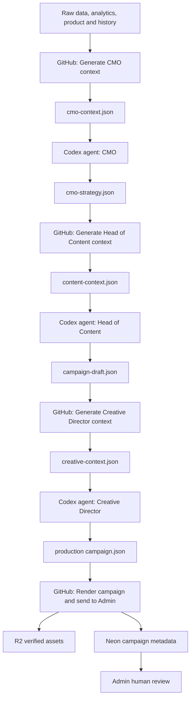
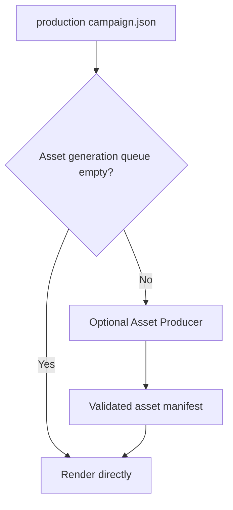

# Marketing automation implementation plan

**Status:** Phase 1 audit and contract freeze completed — awaiting review  
**Date:** 2026-07-24  
**Related architecture:** `Docs/marketing/automated-marketing-system.md`

This document freezes the intended implementation order before code changes begin. It must be updated whenever scope, agent boundaries, orchestration, observability or rollout order changes.

## 1. Final responsibility model

The system uses three reasoning agents and deterministic GitHub automation between them.

| Stage | Type | Responsibility | Output |
|---|---|---|---|
| Generate CMO context | GitHub Action / deterministic code | Gather validated evidence, analytics, product context, history, constraints and assets | `cmo-context.json` |
| CMO | Codex Cloud agent | Decide monthly strategy, priorities, pillars, experiments and measurement plan | `cmo-strategy.json` + strategy Markdown |
| Generate Head of Content context | GitHub Action / deterministic code | Combine validated CMO context and strategy into the next agent input | `content-context.json` |
| Head of Content | Codex Cloud agent | Define campaign architecture, posts, captions, dates, tracking, hypotheses and semantic visual briefs | `campaign-draft.json` |
| Generate Creative Director context | GitHub Action / deterministic code | Package campaign draft, renderer capabilities, approved assets and visual rules | `creative-context.json` |
| Creative Director | Codex Cloud agent | Choose exact layouts, assets, screenshot treatment and renderer jobs | production `campaign.json` |
| Render and deliver | GitHub Action / deterministic code | Validate, render, upload to R2, verify, import to Neon and expose in Admin | campaign in Admin as `needs_review` |

The Creative Director is an **agent**, not an Action. Choosing exact compositions, layouts, assets and visual treatments is a non-deterministic creative decision. GitHub Actions prepare its evidence and validate its output.

## 2. Artifact chain



The successful renderer path begins only from the production `campaign.json`. The July campaign proved the downstream path from a renderer-complete campaign document to Admin, but that document was enriched beyond the current Head of Content contract. The new Creative Director stage formalizes that enrichment.

## 3. Human-presence policy

Routine monthly generation must not require human approval between agents.

Remove the current intermediate requirement based on:

- `approve_strategy` workflow input;
- `--approve-strategy` CLI flag;
- `approval_authority: human_workflow_dispatch`;
- Head of Content preconditions requiring human-approved strategy.

Replace it with a validated pipeline handoff, for example:

```text
approval_authority: automated_marketing_pipeline
```

The first mandatory human checkpoint is the Admin review. Humans continue to:

- inspect and edit posts;
- approve or reject posts;
- replace exceptional images;
- save unfinished review;
- authorize CSV export and external publication.

## 4. Asset Producer decision

The Asset Producer is not part of the mandatory happy path.

The existing renderer can use approved, registered screenshots and scenes directly. The Asset Producer runs only when the production campaign requires a new or transformed source asset.



Do not delete the Asset Producer until dependency analysis proves that no active workflow, schema, validator or renderer path needs it. First reclassify it as optional; clean legacy only after the new end-to-end flow is observable and proven.

## 5. Orchestration model

GitHub owns deterministic orchestration. Codex Cloud agents are scheduled workers because a native event trigger from GitHub into Codex Cloud is not yet assumed.

Pattern:

```text
GitHub Action creates validated input
→ scheduled Codex agent discovers pending work
→ agent commits validated output
→ GitHub reacts to the output and prepares the next input
```

Each Codex agent must discover work robustly:

1. inspect `automation/marketing-cycle-*` branches;
2. find the latest non-future period with valid required input;
3. skip periods whose valid output already corresponds to that input;
4. acquire a per-period lock or prove no active run exists;
5. execute the repository agent contract;
6. validate output before commit;
7. write failure state without partial success when blocked.

Scheduled checks should run only in a short monthly window, for example several times on days 1 and 2. They are idempotent and exit quickly when no work is pending.

## 6. Required observability before legacy cleanup

Observability is a release prerequisite, not a later polish item.

### 6.1 Pipeline state in Admin

For each period, Admin must display:

- current overall status;
- all pipeline stages in order;
- state, start/end time and attempt count;
- input and output hashes;
- GitHub workflow run or Codex task reference;
- concise error message;
- access to operational logs;
- recovery action when available.

Required stage states:

```text
not_started
waiting
running
completed
failed
blocked
skipped
```

### 6.2 Persistent run model

The implementation should persist at least:

- one pipeline run per period and attempt;
- one stage record per pipeline run;
- append-only events for transitions, validations, warnings and errors.

Do not persist private model reasoning, credentials, complete environment values or unrestricted raw logs.

### 6.3 Logs

Logs must answer:

- what stage failed;
- which period and branch were involved;
- which input and output hashes were used;
- which validator failed;
- whether the stage can retry safely;
- what action is required from a human.

### 6.4 Notifications

During rollout, notify for:

- monthly cycle started;
- each agent artifact completed;
- stage failed or became blocked;
- render/import completed;
- campaign ready for review.

After stabilization, routine success notifications may be reduced to one final notification while failures remain immediate.

Preferred delivery is the existing Innerbloom mobile push infrastructure if it is suitable. Audit that integration before adding another provider. A fallback channel may be selected during implementation if mobile push cannot deliver operational notifications reliably.

## 7. Implementation phases

### Phase 1 — Audit and contract freeze

Status: **completed in documentation; awaiting review**.

Deliverables:

- `Docs/marketing/phase-1-audit-and-contracts.md`;
- `Docs/marketing/contracts/campaign-draft-v1.md`;
- `Docs/marketing/contracts/creative-director-v1.md`.

No production behavior changes in this phase.

### Phase 2 — Remove intermediate human approval

- replace human dispatch approval with validated pipeline authorization;
- preserve manual dispatch only for recovery;
- update builder, schema, workflow and Head of Content preconditions;
- add tests proving invalid strategy still fails closed.

### Phase 3 — Head of Content draft artifact

- introduce `campaign-draft.json` schema;
- update Head of Content prompt and agent contract;
- validate preservation of CMO strategy;
- stop writing production `campaign.json` from this agent.

### Phase 4 — Creative Director

- create deterministic `creative-context.json` builder;
- define Creative Director prompt, agent contract and schemas;
- generate renderer-complete `campaign.json`;
- add preservation and renderer compatibility validators.

### Phase 5 — Pipeline persistence and logs

- add Neon run, stage and event records;
- record transitions from GitHub and agent handoffs;
- implement idempotency keys, hashes and safe retry behavior;
- retain bounded operational logs.

### Phase 6 — Admin observability

- add pipeline status and timeline to Marketing Admin;
- show errors and recovery information;
- link to GitHub or Codex execution details when available;
- do not expose secrets or private model reasoning.

### Phase 7 — Notifications

- audit and reuse mobile push infrastructure where possible;
- add event-based operational notifications;
- prevent duplicate notifications during retries;
- support final `ready_for_review` notification.

### Phase 8 — GitHub orchestration

- add path-aware triggers for agent outputs;
- build next-agent contexts automatically;
- trigger renderer from validated production `campaign.json`;
- retain manual recovery inputs;
- ensure Actions do not rely on a `GITHUB_TOKEN` push recursively triggering another Action.

### Phase 9 — Shadow end-to-end run

Run one isolated period through:

```text
contexts
→ CMO
→ Head of Content
→ Creative Director
→ campaign validation
→ preview render
→ complete render
→ R2 verification
→ Neon import
→ Admin review state
```

First use a limited preview that cannot modify Admin. Only after all contracts pass, run the complete campaign with a unique campaign code.

### Phase 10 — Legacy cleanup

Only after the observable shadow run succeeds:

- remove superseded human approval paths;
- remove confirmed unused renderer and import paths;
- update or archive the Asset Producer contract;
- remove obsolete documentation;
- retain recovery workflows deliberately.

### Phase 11 — Codex Cloud schedules

Configure the three scheduled automations only after repository contracts and handoffs are proven:

- CMO;
- Head of Content;
- Creative Director.

The repository must contain the full prompts and discovery logic before the account-level Codex schedules are created.

## 8. Release gates

No phase may advance merely because its code merged.

Required gates:

- schemas and business validators pass;
- idempotent retry is demonstrated;
- failure produces no partial downstream campaign;
- Admin displays truthful status;
- notification behavior is tested;
- no step before Admin requires routine human presence;
- production render remains compatible with the successful July path.

## 9. Current stopping point

The plan and Phase 1 contracts are now documented. No workflow, prompt, production schema, renderer, Neon model, Admin screen or Codex schedule has been changed yet.

The next implementation step, after review, is **Phase 2: remove intermediate human approval**.