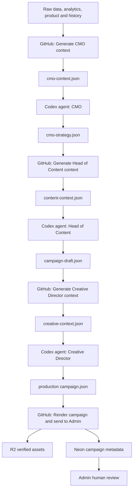
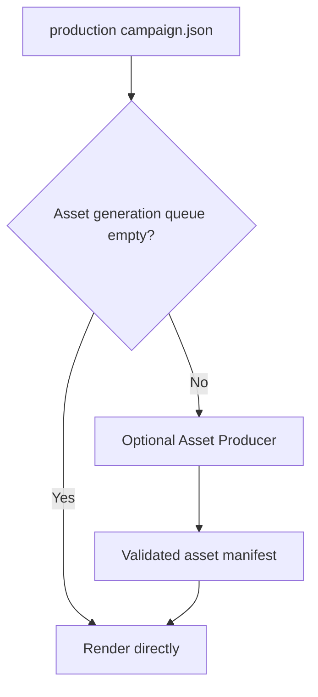

# Marketing automation implementation plan

**Status:** approved planning baseline — implementation not started  
**Date:** 2026-07-24  
**Related architecture:** `Docs/marketing/automated-marketing-system.md`

This document freezes the intended implementation order before code changes begin. It must be updated whenever scope, agent boundaries, orchestration, observability or rollout order changes.

## 1. Final responsibility model

The system uses three reasoning agents and deterministic GitHub automation between them.

| Stage | Type | Responsibility | Output |
|---|---|---|---|
| Generate CMO context | GitHub Action / deterministic code | Gather validated evidence, analytics, product context, history, constraints and assets | `cmo-context.json` |
| CMO | Codex Cloud agent | Decide monthly strategy, priorities, pillars, experiments and measurement plan | `cmo-strategy.json` + strategy Markdown |
| Generate Head of Content context | GitHub Action / deterministic code | Combine validated CMO context and strategy into the next agent input | `content-context.json` |
| Head of Content | Codex Cloud agent | Define campaign architecture, posts, captions, dates, tracking, hypotheses and semantic visual briefs | `campaign-draft.json` |
| Generate Creative Director context | GitHub Action / deterministic code | Package campaign draft, renderer capabilities, approved assets and visual rules | `creative-context.json` |
| Creative Director | Codex Cloud agent | Choose exact layouts, assets, screenshot treatment and renderer jobs | production `campaign.json` |
| Render and deliver | GitHub Action / deterministic code | Validate, render, upload to R2, verify, import to Neon and expose in Admin | campaign in Admin as `needs_review` |

The Creative Director is an **agent**, not an Action. Choosing exact compositions, layouts, assets and visual treatments is a non-deterministic creative decision. GitHub Actions prepare its evidence and validate its output.

## 2. Artifact chain



The successful renderer path begins only from the production `campaign.json`. The July campaign proved the downstream path from a renderer-complete campaign document to Admin, but that document was enriched beyond the current Head of Content contract. The new Creative Director stage formalizes that enrichment.

## 3. Human-presence policy

Routine monthly generation must not require human approval between agents.

Remove the current intermediate requirement based on:

- `approve_strategy` workflow input;
- `--approve-strategy` CLI flag;
- `approval_authority: human_workflow_dispatch`;
- Head of Content preconditions requiring human-approved strategy.

Replace it with a validated pipeline handoff, for example:

```text
approval_authority: automated_marketing_pipeline
```

The first mandatory human checkpoint is the Admin review. Humans continue to:

- inspect and edit posts;
- approve or reject posts;
- replace exceptional images;
- save unfinished review;
- authorize CSV export and external publication.

## 4. Asset Producer decision

The Asset Producer is not part of the mandatory happy path.

The existing renderer can use approved, registered screenshots and scenes directly. The Asset Producer runs only when the production campaign requires a new or transformed source asset.



Do not delete the Asset Producer until dependency analysis proves that no active workflow, schema, validator or renderer path needs it. First reclassify it as optional; clean legacy only after the new end-to-end flow is observable and proven.

## 5. Orchestration model

GitHub owns deterministic orchestration. Codex Cloud agents are scheduled workers because a native event trigger from GitHub into Codex Cloud is not yet assumed.

Pattern:

```text
GitHub Action creates validated input
→ scheduled Codex agent discovers pending work
→ agent commits validated output
→ GitHub reacts to the output and prepares the next input
```

Each Codex agent must discover work robustly:

1. inspect `automation/marketing-cycle-*` branches;
2. find the latest non-future period with valid required input;
3. skip periods whose valid output already corresponds to that input;
4. acquire a per-period lock or prove no active run exists;
5. execute the repository agent contract;
6. validate output before commit;
7. write failure state without partial success when blocked.

Scheduled checks should run only in a short monthly window, for example several times on days 1 and 2. They are idempotent and exit quickly when no work is pending.

## 6. Required observability before legacy cleanup

Observability is a release prerequisite, not a later polish item.

### 6.1 Pipeline state in Admin

Marketing Admin must show the active period and every stage:

```text
CMO context
CMO agent
Head of Content context
Head of Content agent
Creative Director context
Creative Director agent
Campaign validation
Render
R2 verification
Neon import
Ready for review
```

Each stage needs:

- status: `not_started`, `waiting`, `running`, `completed`, `failed`, `blocked` or `skipped`;
- started and completed timestamps;
- input and output paths;
- input/output SHA values;
- GitHub run ID or Codex task reference where available;
- attempt count;
- concise error summary;
- link or reference to detailed logs;
- recovery action when one exists.

### 6.2 Logs

Persist structured pipeline events, not only GitHub console text. Recommended entities:

- `marketing_pipeline_runs` — one row per period/run;
- `marketing_pipeline_stages` — current status and provenance per stage;
- `marketing_pipeline_events` — append-only timeline and error records.

Do not store credentials, raw secrets or unnecessary model chain-of-thought. Store operational inputs, outputs, validation reports and concise failure evidence.

### 6.3 Notifications

Support event notifications for at least:

- monthly pipeline started;
- agent output completed;
- stage failed or became blocked;
- render/import completed;
- campaign ready for Admin review.

During rollout, detailed stage notifications may be enabled. The mature default should avoid noise and notify mainly on failures and `ready_for_review`.

The delivery channel must be selected during implementation according to existing Innerbloom notification infrastructure. Mobile push is preferred when reliable; email or another existing channel may be used as fallback.

## 7. Production campaign contract

The Head of Content output is renamed conceptually to `campaign-draft.json`. It owns content decisions but must not pretend to know renderer internals.

The Creative Director converts that draft into the production `campaign.json`, including at least:

- exact `image_generation.jobs`;
- exact `creative_direction` per job;
- supported `layout_variant`;
- approved `selected_asset_keys`;
- palette and device mode;
- screenshot surface/container compatibility;
- supporting treatments and annotations;
- carousel visual progression;
- truthful source-asset mapping;
- optional `asset_generation_queue` only when genuinely required.

The production document must pass the same or stricter gates that protected the successful July renderer path, including layout diversity, asset validity, carousel diversity and no web screenshot inside a phone carcass.

## 8. Implementation sequence

No Codex schedule should be created until the repository contracts and observability are ready.

### Phase 0 — Audit and freeze contracts

- inventory active and legacy marketing files;
- trace consumers of Asset Producer, old renderers and inline/base64 import paths;
- define schemas for `campaign-draft.json`, `creative-context.json` and production `campaign.json`;
- define per-stage state and event schemas;
- add contract fixtures based on the successful July campaign;
- document recovery and idempotency rules.

**Exit:** agreed schemas and migration plan; no production behavior changed.

### Phase 1 — Remove intermediate human approval

- remove `approve_strategy` from the normal path;
- replace human approval wrapper with pipeline authorization;
- preserve manual recovery dispatch without making it a routine gate;
- update Head of Content contract and validators;
- keep final posts as `needs_review`.

**Exit:** CMO strategy can flow automatically into Head of Content context.

### Phase 2 — Split campaign draft from creative production

- make Head of Content emit `campaign-draft.json`;
- create Creative Director prompt, AGENTS contract and schemas;
- build deterministic Creative Director context generator;
- make Creative Director emit renderer-complete `campaign.json`;
- add compatibility rules for mobile/web screenshots and supported layouts.

**Exit:** agents can reproduce a renderer-valid campaign without manual enrichment.

### Phase 3 — Pipeline state, logs and notifications

- add Neon pipeline-run, stage and event persistence;
- expose pipeline endpoints;
- add Admin process timeline and error/log views;
- add notifications for failures and campaign readiness;
- provide retry/recovery controls with authorization.

**Exit:** a user can see where every period is, why it failed and what to do next.

### Phase 4 — GitHub event orchestration

- react to Codex output commits by validated path and period;
- generate the next deterministic context automatically;
- trigger renderer when production `campaign.json` appears;
- add locks, SHA provenance, duplicate protection and retries;
- preserve manual dispatch as recovery only.

**Exit:** repository artifacts move automatically between agents and Actions.

### Phase 5 — End-to-end shadow run

- run a new isolated test period/campaign;
- exercise all three agents;
- render a pilot first without Neon import;
- run full render/import only after all contracts pass;
- verify Admin state, R2, Neon, CSV and Metricool compatibility;
- intentionally simulate at least one failure per major boundary.

**Exit:** complete automated flow reaches Admin with useful status and error reporting.

### Phase 6 — Legacy cleanup

Only after the shadow run succeeds:

- remove unused inline/base64 production paths;
- archive superseded renderer/prompts/configuration;
- remove obsolete manual-flow documentation;
- keep R2 repair as an emergency tool;
- retain Asset Producer as optional unless proven unused;
- verify no imports, workflows or tests still depend on removed files.

**Exit:** one canonical production path with no misleading legacy routes.

### Phase 7 — Create Codex Cloud automations

Create and authorize three scheduled Codex Cloud workers:

1. CMO;
2. Head of Content;
3. Creative Director.

For each automation define:

- repository and environment;
- exact versioned prompt/instructions;
- scheduled monthly window;
- branch discovery logic;
- allowed writes;
- validation command;
- commit behavior;
- failure reporting;
- usage limits.

This step requires the repository contracts to be merged and the account owner to authorize Codex Cloud repository access.

## 9. Planned PR breakdown

1. **Audit and schema plan** — inventory, contracts, fixtures and state model.
2. **Automated strategy handoff** — remove intermediate human approval.
3. **Head of Content campaign draft** — formalize `campaign-draft.json`.
4. **Creative Director agent** — context, prompt, schema and production `campaign.json`.
5. **Pipeline persistence and API** — runs, stages and event logs.
6. **Admin pipeline observability** — timeline, logs, failures and recovery UI.
7. **Notifications** — failure and ready-for-review delivery.
8. **GitHub orchestration** — path triggers, locks, SHA provenance and render handoff.
9. **End-to-end shadow campaign** — full verification and failure drills.
10. **Legacy cleanup** — remove only what the proven path no longer uses.
11. **Codex Cloud setup guide** — final prompts, schedules and manual account steps.

Each PR must update the architecture document and this plan when its decisions or status change.

## 10. Current stopping point

Planning is complete enough to begin Phase 0, but no implementation should start until explicitly authorized.

Current decisions:

- three reasoning agents: CMO, Head of Content and Creative Director;
- Asset Producer is optional;
- no routine human approval before Admin;
- observability and notifications precede legacy cleanup;
- Codex Cloud scheduling is configured last, after repository support is proven;
- the successful renderer/R2/Neon/Admin path remains the downstream baseline.